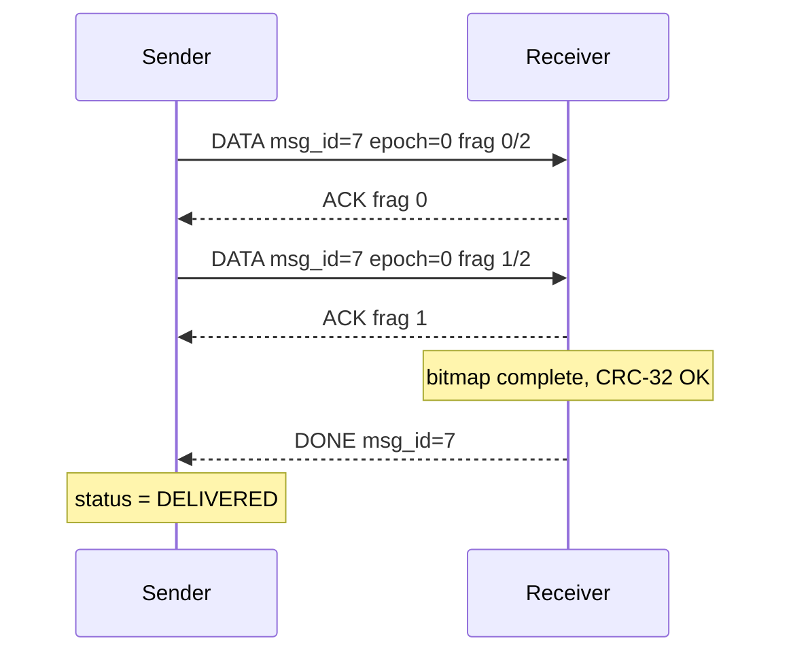
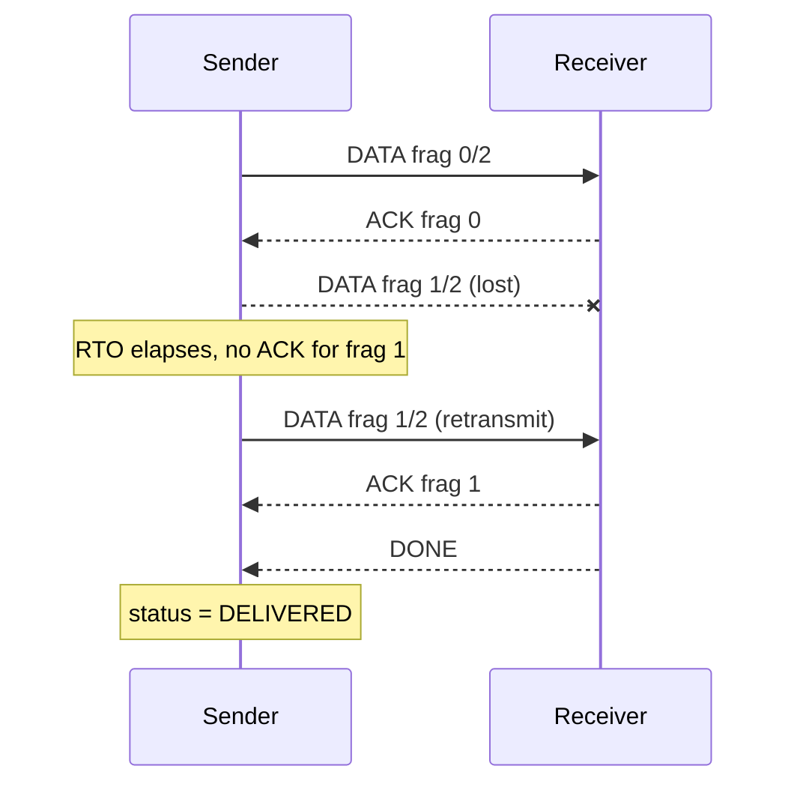
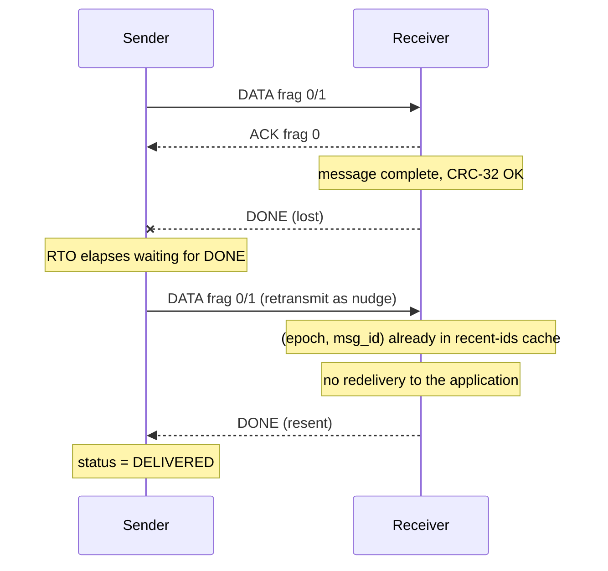
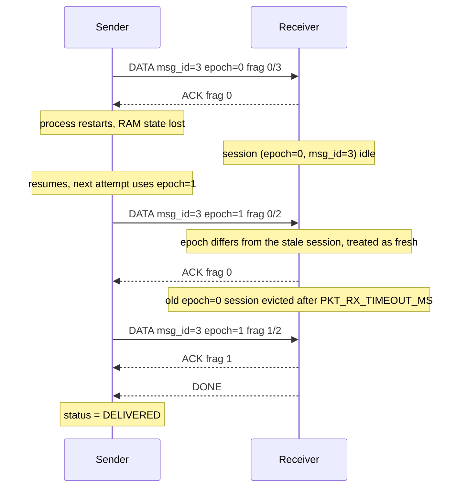

# Packetizer Protocol

This document is the source of truth for the wire format and the reliability mechanisms
of the packetizer. If the implementation needs to diverge from what is written here, that
is a design discussion, not a coding decision, and should happen before the code changes.

All multi-byte integers are little-endian. All sizes below use the defaults in
`pkt_config.h`: `PKT_MAX_PAYLOAD=128`, `PKT_MAX_MESSAGE=4096`, `PKT_TX_WINDOW=8`,
`PKT_MAX_TX_MSGS=4`, `PKT_MAX_RX_SESSIONS=2`, `PKT_RECENT_IDS=8`, `PKT_RTO_MS=200`,
`PKT_RTO_MAX_MS=2000`, `PKT_MAX_RETRIES=8`, `PKT_MSG_RETRIES=2`, `PKT_RX_TIMEOUT_MS=5000`.
Every one of them is overridable at build time.

## 1. Assumptions

Target device: on the order of 16 KB of RAM, no heap. Every buffer the core touches is
allocated by the caller, at compile time or on its stack, and sized from the constants in
`pkt_config.h`. No `malloc`, so no partial allocation failures to handle either.

Link: byte-oriented, point-to-point, half or full duplex. It could be a UART, a raw TCP
socket, a pipe between two processes on the same host. The core does not know or care
which; it consumes bytes and produces bytes.

Expected failure modes, all of which are assumed to happen in normal operation, not just
under attack: bytes lost outright, bytes corrupted in transit, whole frames duplicated,
a frame arriving split across multiple reads or merged with the next one (the link gives
no message boundaries of its own), and occasional reordering (a byte stream does not
guarantee order once buffering or retransmission is involved anywhere below this layer).

Out of scope:

- Security against an adversary who controls the link. CRCs catch noise, not tampering.
  See section 6 and the evolution notes in section 13 for what closing that gap would take.
- Multipoint topologies. `msg_id` and `epoch` identify a message on one link between two
  peers; there is no source or destination address field.
- Congestion control. The window in section 7 bounds how much is unacknowledged at once,
  which incidentally throttles the sender, but there is no bandwidth estimation or backoff
  driven by anything other than fragment loss.

## 2. Layering

Three layers, each one unaware of the one above it:

- **Core** (`lib/packetizer`): COBS framing, header encode/decode, both CRCs, fragmentation
  and reassembly, the selective-repeat state machine, delivery status. Pure state
  transitions over caller-owned structs. No I/O.
- **Application protocol** (section 12): interprets the bytes the core hands back after a
  message is fully reassembled. Does not know about fragments, ACKs, retries or CRCs; it
  just receives "message N, this many bytes, intact."
- **Transport**: whatever moves the encoded byte stream between the two processes, a
  socket, a pipe, a real UART. Entirely outside the core, swappable without touching it.

The core never reads a clock and never calls into an OS. Time comes in as a `now_ms`
parameter on every call that needs it. This is not a style preference, it is what makes
the RTO and timeout logic testable: a unit test can drive the state machine through eight
retries and a session timeout by handing it fabricated timestamps, with no real sleeping
and no flakiness from scheduler jitter. The same core also compiles unchanged on bare
metal driven by a hardware tick, or inside a Linux process calling `clock_gettime`, because
it never picked a clock source for itself. It is also why there are no global mutable
variables: two independent links (or two directions of one duplex link) can run two
independent instances of the same struct without any shared state to corrupt.

## 3. Framing: COBS + 0x00

Frames are encoded with Consistent Overhead Byte Stuffing and terminated with a single
`0x00` delimiter. COBS's property that matters here: a zero byte can never appear inside
an encoded frame, so `0x00` is unambiguously a frame boundary on the wire, and the decoder
never needs to guess where a frame ends.

COBS overhead is one length byte for any run of up to 254 bytes containing no zero. It
works by replacing the gap before each zero (or before the 254th byte, if none is found)
with a byte recording that distance. For a frame up to 254 bytes total, there is only ever
one such gap to record, at the very front, regardless of how many zero bytes happen to sit
inside the header, payload or CRC. So the overhead is exactly one byte, fixed, independent
of content, as long as the frame does not exceed 254 bytes. That is a static invariant we
rely on: `PKT_MAX_FRAME = PKT_HEADER_SIZE + PKT_MAX_PAYLOAD + PKT_CRC_SIZE = 8 + 128 + 2 =
138`, comfortably under 254, and `pkt_config.h` asserts it at compile time so a future
change to the payload limit cannot silently break the arithmetic. Wire size is then
`PKT_MAX_WIRE_FRAME = 138 + 1 (COBS overhead) + 1 (delimiter) = 140` bytes for a full
fragment.

Compared to two common byte-oriented alternatives:

| Framing | Escapes | Worst case for our 138-byte frame | Typical case | Resync |
|---|---|---|---|---|
| COBS + 0x00 | one length byte per ≤254-byte run | 138 + 2 = 140 bytes, always | same, content does not matter | any `0x00` is a frame boundary; the byte can never occur mid-frame |
| SLIP | doubles each `0xC0` or `0xDB` byte, plus a trailing `0xC0` | every byte needs escaping: 138×2 + 1 = 277 bytes | 2 of 256 byte values escape, so ~138×2/256 ≈ 1.1 extra bytes | boundary is the next `0xC0`, but a corrupted escape can consume the wrong following byte first |
| Async HDLC (byte-stuffed, e.g. PPP) | escapes `0x7E`, `0x7D` and control bytes `0x00`-`0x1F` | same doubling logic: 277 bytes | 33 of 256 values escape, ~138×33/256 ≈ 17.8 extra bytes | same class of guarantee as SLIP |

The reason to prefer COBS on a device with no heap is not the average case, it is that the
worst case equals the average case. A static receive buffer can be sized at
`PKT_MAX_WIRE_FRAME` with no safety margin for "what if this frame happened to need every
byte escaped." SLIP and byte-stuffed HDLC need that margin, or a bound on how much of the
frame can be adversarial byte values, which is exactly the kind of assumption a lossy link
should not get to violate.

Corruption of the delimiter byte itself is the one case this scheme does not recover from
immediately. Every other single-bit corruption, wherever it lands, still leaves the frame's
real trailing `0x00` intact, so the deframer always finds a clean boundary at the point the
sender actually put one, rejects whatever garbage decoded in between, and is ready for the
next frame with an empty buffer. But if a bit flip turns that trailing `0x00` into something
else, there is no longer any boundary marking where the frame ends: COBS's own invariant
guarantees no other `0x00` can appear until the next frame's real delimiter, so the corrupted
frame's bytes run straight into it, and the two are judged, and rejected, together as one
blob. The frame that would otherwise have followed is lost along with the corruption, not
just the corrupted one. Full recovery is only guaranteed starting from the next correct
delimiter after that.

## 4. Header

Every frame, regardless of type, carries the same 8-byte header immediately after COBS
decoding:

| Offset | Size | Field | Meaning |
|---|---|---|---|
| 0 | 1 | `ver:4 \| type:4` | protocol version (currently 1) in the high nibble, frame type in the low nibble |
| 1 | 1 | `epoch` | sender incarnation counter, see section 8 |
| 2 | 2 | `msg_id` | message identifier, u16 LE |
| 4 | 2 | `frag_idx` | index of this fragment within the message, u16 LE |
| 6 | 2 | `frag_cnt` | total fragment count for this message, u16 LE |

Frame types: `DATA=1`, `ACK=2`, `DONE=3`, `NACK=4`.

There is no length field and no offset field, and both omissions are deliberate rather
than oversights.

Length is redundant: COBS decoding already yields the exact decoded frame length, since
the `0x00` delimiter is the frame's own boundary. Payload length for a given fragment
follows from `frag_idx`, `frag_cnt` and that decoded length: every fragment except the last
carries a full `PKT_MAX_PAYLOAD` bytes, and the last one carries whatever remainder falls
out of the arithmetic in section 5. Repeating that count inside the header would be a
second copy of information the receiver can already derive, and a second place for
corruption to disagree with itself.

Offset is also derivable, because fragments have fixed size. Fragment 0 carries
`PKT_MAX_PAYLOAD - PKT_META_SIZE` bytes of message data (the rest of its payload slot is
metadata, section 5); every fragment after it carries `PKT_MAX_PAYLOAD` bytes. So:

```
offset(0) = 0
offset(i) = (PKT_MAX_PAYLOAD - PKT_META_SIZE) + (i - 1) * PKT_MAX_PAYLOAD   for i >= 1
```

Sending that number explicitly would cost 4 more bytes on every single fragment for a
value that a lookup already gives us for free.

## 5. First-fragment metadata

Fragment 0's payload does not start with message data. Its first `PKT_META_SIZE = 8`
bytes are:

| Offset in payload | Size | Field |
|---|---|---|
| 0 | 4 | `total_len` (u32 LE): full message length in bytes |
| 4 | 4 | `msg_crc32` (u32 LE): CRC-32 over the full reassembled message |

The remaining `PKT_MAX_PAYLOAD - PKT_META_SIZE = 120` bytes of fragment 0's payload slot
carry message data, same as any other fragment's payload.

On receiving a fragment with `frag_idx == 0`, the receiver validates, in order:

1. Header sanity: `ver == 1`, `type == DATA`, `frag_cnt >= 1`. A fragment failing this is
   dropped; CRC-16 already told us the header cannot be trusted, so there is nothing to
   NACK against.
2. `total_len <= PKT_MAX_MESSAGE`, otherwise NACK `TOO_BIG`. The receiver will not attempt
   to reserve a session it cannot ever complete.
3. `frag_cnt` matches what `total_len` implies: `frag_cnt == ceil((total_len +
   PKT_META_SIZE) / PKT_MAX_PAYLOAD)`. A mismatch means the two fields disagree with each
   other despite passing CRC-16, which can only mean malformed input, so NACK
   `MALFORMED`.
4. If `(epoch, msg_id)` is already in the recent-ids cache (section 8), this is a duplicate
   of an already-delivered message: no new session, just resend `DONE`.
5. If all `PKT_MAX_RX_SESSIONS` slots are occupied by other in-progress messages, NACK
   `NO_SESSION`, there is nowhere to track this one yet.
6. Otherwise, open a new reassembly session and start accepting the rest of the fragments.

Fragments with `frag_idx > 0` are validated against the session opened by fragment 0: the
session must exist for that `(epoch, msg_id)` (otherwise NACK `NO_SESSION`, most likely
fragment 0 was lost or the session was evicted), `frag_idx < frag_cnt`, and the payload
length must match what section 4's derivation predicts for that index (otherwise NACK
`MALFORMED`).

## 6. Integrity: two CRCs

**CRC-16/CCITT-FALSE** covers header + payload of a single frame and rides along in every
frame (`CRC1` in the wire layout). It protects the fields reassembly depends on,
`frag_idx`, `frag_cnt`, `msg_id`, before they are trusted for anything: a bit flip in
`frag_idx` that passed unnoticed would place a fragment's data at the wrong offset with no
other check catching it.

**CRC-32/ISO-HDLC** covers the entire reassembled message (`msg_crc32` in fragment 0's
metadata) and is checked exactly once, after every fragment has arrived. It catches what
no per-frame CRC ever could: a fragment silently dropped and never retransmitted for some
reason, two fragments swapped, or a reassembly bug placing bytes at the wrong offset. None
of that corrupts any individual frame, so CRC-16 has nothing to object to; only a check
over the assembled whole can see it.

Both checks are being asked to guarantee something at a specific size, so it is worth being
precise about what they actually guarantee there. Per Koopman's published Hamming-distance
tables, the 0x1021 polynomial (CRC-16/CCITT-FALSE) holds HD=4 for data lengths up to 32,751
bits: any 1, 2 or 3-bit error is caught with certainty, and so is any burst error up to 16
bits long, but not every possible 4-bit error. There is no HD=6 plateau for this polynomial
at any length relevant here; HD=6 belongs to different, shorter polynomials chosen
specifically for short frames, and 0x1021 is not one of them. The largest span this
protocol asks CRC-16 to protect is a full frame, `PKT_MAX_FRAME = 138` bytes, 1104 bits,
which sits far below the 32,751-bit limit; every smaller frame (ACK, DONE, NACK) is further
inside the same bound. So the HD=4 guarantee holds without qualification across every frame
size this protocol produces. CRC-32/ISO-HDLC's own HD=4 bound runs to roughly 91,607 bits,
and our largest reassembled message is `PKT_MAX_MESSAGE × 8 = 32,768` bits, again
comfortably inside it. Neither check is compensating for the other losing strength at
scale, both keep their full HD=4 guarantee at every size in play here. The reason for
having two is scope, not strength: CRC-16 catches frame-level corruption immediately, before
a bad fragment is ever used for reassembly, while CRC-32 is the only check that ever looks
at the reassembled whole, which is where a dropped, duplicated or misplaced fragment shows
up instead.

Neither CRC is a security mechanism. Both polynomials are public and linear: anyone able
to alter a frame in transit can recompute a matching CRC-16 or CRC-32 over the altered
bytes. These checks exist to catch the noise a bad link introduces, not to detect
tampering by someone who wants to. See section 13 for what closing that gap requires.

## 7. Reliability: Selective Repeat

The sender keeps up to `PKT_TX_WINDOW = 8` fragments of a message unacknowledged at once.
Selective repeat means only the fragments that are actually missing get retransmitted, not
the whole window, unlike Go-Back-N. `PKT_MAX_TX_MSGS = 4` messages can be in flight this
way at the same time, each with its own window; this is also what lets, for instance, a
short text message overtake an in-progress file chunk instead of queuing behind it.

Each transmitted fragment starts an RTO timer. On timeout with no ACK, that one fragment is
retransmitted and the timer for it backs off exponentially: `PKT_RTO_MS` doubling on each
consecutive timeout up to `PKT_RTO_MAX_MS`. With the defaults that sequence is 200, 400,
800, 1600, then capped at 2000 ms from the fifth attempt on. Retries are capped by
`PKT_MAX_RETRIES = 8`; summing the worst case, `200 + 400 + 800 + 1600 + 2000×4 = 11000`
ms, about 11 seconds, is the longest a single fragment (and, since fragments in a window
retry independently rather than serially, effectively the whole message) waits before the
sender gives up and reports `TIMEOUT`.

`DONE` closes out a message from the sender's side. Once the receiver's fragment bitmap for
a session is complete, it checks `msg_crc32` over the reassembly and, if it matches, sends
`DONE`; the sender frees that message's slot only on receiving it. If `DONE` is lost, the
sender still has an outstanding, unacknowledged "message complete" state, so it applies the
same RTO logic to it, but reuses existing machinery instead of defining a new frame type:
it retransmits the last fragment as a nudge. The receiver, seeing `(epoch, msg_id)` already
in its recent-ids cache, recognizes the duplicate, does not redeliver to the application,
and just resends `DONE`.

NACK reasons and the sender's reaction to each:

- `TOO_BIG`, `MALFORMED`: immediate failure, no retry. Retrying identical bytes against a
  message that is definitionally too large, or a request the receiver already found
  internally inconsistent, changes nothing. Delivery status becomes `REJECTED`.
- `NO_SESSION`: treated as an ordinary lost fragment. The receiver may simply not have seen
  fragment 0 yet (reordering) or evicted the session (section 8), so the sender retries
  with the standard RTO backoff, most usefully by resending fragment 0 to reestablish the
  session.
- `BAD_CRC`: the assembled message failed CRC-32 despite every fragment individually
  passing CRC-16, which points at a reassembly-level problem rather than one this specific
  fragment retry would fix. The sender restarts the whole message from fragment 0, bumping
  `epoch` so the receiver can tell the new attempt's fragments apart from anything left
  over from the failed one, up to `PKT_MSG_RETRIES = 2` restarts before giving up
  (`REJECTED`).

## 8. Duplicates and restarts

`msg_id` is a 16-bit counter; over a long-running link it wraps. `epoch` is an 8-bit
counter the sender bumps on events that invalidate its own prior sequencing, most notably
restarting the message after `BAD_CRC`, or the sender process itself restarting and losing
its RAM-resident `msg_id` state. The receiver keys duplicate detection on `(epoch,
msg_id)`, not `msg_id` alone, specifically so a wraparound or a sender restart cannot
collide with a stale cached id from before and get treated as "already delivered" when it
is not.

The receiver keeps a small cache of the last `PKT_RECENT_IDS = 8` completed `(epoch,
msg_id)` pairs. Any fragment matching an entry in that cache is a duplicate of a message
already delivered to the application: no new session, no redelivery, just a resent `DONE`.

There is no explicit abort frame, so a sender that disappears mid-transfer would otherwise
pin an RX session slot forever. A session that receives no new fragment for `PKT_RX_TIMEOUT_MS
= 5000` ms is abandoned and its slot freed. With only `PKT_MAX_RX_SESSIONS = 2` slots, a
stuck session is a meaningful fraction of the receiver's capacity, so this timeout is not
optional.

## 9. Delivery status

Three outcomes are exposed to the application per message:

- `DELIVERED`: the sender received `DONE` for the message.
- `TIMEOUT`: the sender exhausted its retries (section 7) without a response at all, the
  peer is presumed unreachable or the link too lossy.
- `REJECTED`: the peer responded, explicitly, with a NACK the sender is not going to argue
  with (`TOO_BIG`, `MALFORMED`), or with enough consecutive `BAD_CRC` to exhaust
  `PKT_MSG_RETRIES`.

The distinction between `TIMEOUT` and `REJECTED` is deliberate: one means silence, the
other means the peer is there and said no.

## 10. Sequence diagrams

Normal case:



Fragment lost, recovered by RTO:



DONE lost, recovered by nudge and dedup:



Sender restarted mid-transfer, new epoch:



## 11. Resource budget

Per-frame wire size, from section 3's arithmetic:

- Full `DATA` fragment: `8 (header) + 128 (payload) + 2 (CRC-16) = 138`, plus 2 bytes of
  COBS overhead and delimiter, `140` bytes on the wire.
- `ACK` / `DONE` (empty payload, the header's `msg_id` + `frag_idx` already identify what
  is being acknowledged): `8 + 0 + 2 = 10`, plus 2, `12` bytes.
- `NACK` (1-byte `reason` payload): `8 + 1 + 2 = 11`, plus 2, `13` bytes.

Sending a full `PKT_MAX_MESSAGE = 4096`-byte message costs `PKT_MAX_FRAGS = 33` fragments:
fragment 0 carries 120 message bytes (128 minus the 8-byte metadata), fragments 1 through
31 carry 128 bytes each (`31 × 128 = 3968`), and fragment 32 carries the `4096 - 120 -
3968 = 8`-byte remainder. Wire bytes: `140 (frag 0) + 31 × 140 (full frags) + 20 (8-byte
remainder frag: 8 + 8 + 2 + 2) = 140 + 4340 + 20 = 4500` bytes sent, plus `33 × 12 = 396`
bytes of ACKs and `12` bytes for DONE coming back, `4908` bytes of wire traffic total for
4096 bytes of payload, about 20% overhead once the return-direction ACK traffic is counted.

RAM is the sum of four structs, sized as `sizeof()` would report them on a 32-bit target
(pointers and `size_t` are 4 bytes; that is the realistic class of MCU behind a 16 KB RAM
budget, not an 8-bit part). TX is zero-copy: `pkt_send()` takes a pointer to the caller's
message and its length and does not copy either. The flight table only remembers where the
bytes live, and every transmission or retransmission of a fragment reads directly from that
pointer at the offset section 4 derives. The cost of not copying is a caller obligation: the
buffer has to stay valid until the message reaches a terminal delivery status. RX has no
equivalent caller buffer to point at, fragments arrive scattered over time from the link, so
reassembly has to land somewhere internal until the CRC-32 check passes.

**RX session** (`pkt_rx_session_t`), one per `PKT_MAX_RX_SESSIONS` slot, owns the
reassembly buffer:

| Field | Type | Bytes |
|---|---|---|
| `data` | `uint8_t[PKT_MAX_MESSAGE]` | 4096 |
| `received_mask` | `uint64_t` | 8 |
| `total_len` | `uint32_t` | 4 |
| `msg_crc32` | `uint32_t` | 4 |
| `last_rx_ms` | `uint32_t` | 4 |
| `msg_id` | `uint16_t` | 2 |
| `frag_cnt` | `uint16_t` | 2 |
| `epoch` | `uint8_t` | 1 |
| `state` | `uint8_t` | 1 |

Raw sum 4122 bytes. `data[]` is a multiple of 8, so `received_mask` right after it falls on
an 8-byte boundary for free; the struct's own alignment (8, driven by the `uint64_t`) pads
the tail from 4122 up to 4128. `sizeof(pkt_rx_session_t) = 4128` bytes. Array of
`PKT_MAX_RX_SESSIONS = 2`: `2 × 4128 = 8256` bytes.

**TX flight-table entry** (`pkt_tx_slot_t`), one per `PKT_MAX_TX_MSGS` slot, holds no
message bytes at all:

| Field | Type | Bytes |
|---|---|---|
| `acked_mask` | `uint64_t` | 8 |
| `msg` | `const uint8_t *` | 4 |
| `total_len` | `uint32_t` | 4 |
| `msg_crc32` | `uint32_t` | 4 |
| `rto_deadline_ms` | `uint32_t[PKT_TX_WINDOW]` | 32 |
| `retry_cnt` | `uint8_t[PKT_TX_WINDOW]` | 8 |
| `msg_id` | `uint16_t` | 2 |
| `frag_cnt` | `uint16_t` | 2 |
| `epoch` | `uint8_t` | 1 |
| `msg_retry_cnt` | `uint8_t` | 1 |
| `state` | `uint8_t` | 1 |

Raw sum 67 bytes, laid out with `acked_mask` first so everything else stays on natural
boundaries; the struct's 8-byte alignment pads the tail from 67 up to 72.
`sizeof(pkt_tx_slot_t) = 72` bytes. Array of `PKT_MAX_TX_MSGS = 4`: `4 × 72 = 288` bytes.
`msg_crc32` is computed once, at `pkt_send()` time, over the caller's buffer, and kept here
rather than recomputed on every retransmit; that is the one field this struct holds that is
derived from the message rather than being a pointer into it.

**Deframer** (`pkt_deframer_t`), one instance, decodes the incoming byte stream; there is
nothing to buffer on the encode side beyond the one wire frame being written out fragment
by fragment, so this struct only exists for the receive direction:

| Field | Type | Bytes |
|---|---|---|
| `raw` | `uint8_t[PKT_MAX_WIRE_FRAME]` | 140 |
| `len` | `uint8_t` | 1 |
| `discarding` | `bool` | 1 |

`PKT_MAX_WIRE_FRAME = 140` fits in a `uint8_t` count (max 255), so `len` does not need to be
wider. COBS decoding never expands data, so decoding happens in place in `raw`, no second
buffer needed. `discarding` marks a candidate frame that overflowed `raw` and is being
skipped up to the next delimiter (see `frame.h`/`frame.c`). All fields are byte-aligned, no
padding. `sizeof(pkt_deframer_t) = 142` bytes.

**Recent-ids cache** (`pkt_recent_cache_t`), one instance, `PKT_RECENT_IDS` entries of
`{ uint16_t msg_id; uint8_t epoch; }`: raw entry size 3 bytes, padded to 4 for the
`uint16_t` alignment. `PKT_RECENT_IDS × 4 = 32` bytes, plus a 1-byte ring cursor, padded to
34 for the same reason. `sizeof(pkt_recent_cache_t) = 34` bytes.

| Struct | sizeof | Count | Total |
|---|---|---|---|
| `pkt_rx_session_t` | 4128 | 2 | 8256 |
| `pkt_tx_slot_t` | 72 | 4 | 288 |
| `pkt_deframer_t` | 142 | 1 | 142 |
| `pkt_recent_cache_t` | 34 | 1 | 34 |
| **Total** | | | **8720 bytes ≈ 8.5 KB** |

That fits inside the ~16 KB budget from section 1 with room to spare, roughly half of it
left over for the application layer (file I/O buffers, the caller's own TX message buffers,
which live outside this accounting because of the zero-copy contract above). It did not fit
before this pass: an earlier version of this estimate assumed the TX side copied the
message into its own buffer per slot, which alone cost `4096 × PKT_MAX_TX_MSGS ≈ 16 KB` and
blew the whole budget by itself. Removing that copy is what makes the number here small
enough to matter.

The dominant cost that remains is the RX session buffer: `8256` of the `8720` total bytes,
about 95%, and it is not something the TX zero-copy contract touches, since it protects a
different direction of the link. Fragments arrive spread out over an unpredictable amount
of time and, on a lossy link, out of order, so something has to hold the bytes that have
landed so far until `msg_crc32` can be checked over the complete message; there is no
caller buffer to point at yet because the caller does not know the message exists until it
is fully assembled and delivered. Shrinking it without touching the zero-copy TX design
means either turning down `PKT_MAX_RX_SESSIONS` (already at the minimum useful for two
concurrent senders) or `PKT_MAX_MESSAGE` (which also caps the largest message TX can send,
since it is one constant shared by both directions). A genuinely cheaper RX path would mean
making RX zero-copy too: have the application hand over a receive buffer as soon as
fragment 0's `total_len` is known, before the rest of the message arrives, and reassemble
directly into it. That is a real option, but it changes the API contract (the caller commits
a buffer before any integrity check has run) enough that it is a separate design decision,
not a knob to turn in this document.

## 12. Application protocol: file transfer

Layered above the core: these message types are simply the first byte of whatever the
packetizer hands back after reassembly. The core does not know they exist.

| Type | Value | Layout after the type byte |
|---|---|---|
| `TEXT` | `0x01` | remaining bytes are the text body (length known from the message's `total_len`, no separate field needed) |
| `FILE_OFFER` | `0x10` | `transfer_id:u32`, `size:u32`, `crc32:u32` (whole-file), `name_len:u8`, `name[name_len]` |
| `FILE_ACCEPT` | `0x11` | `transfer_id:u32`, `offset:u32` |
| `FILE_CHUNK` | `0x12` | `transfer_id:u32`, `offset:u32`, chunk bytes (remainder of the message) |
| `FILE_END` | `0x13` | `transfer_id:u32` |
| `FILE_RESULT` | `0x14` | `transfer_id:u32`, `status:u8` |

Each `FILE_CHUNK` is its own packetizer message, with its own `msg_id`, going through the
same DATA/ACK/DONE machinery as anything else. No separate streaming path exists in the
core for file transfer; a file is just a sequence of ordinary messages tagged with a
`transfer_id` the application layer understands.

`FILE_ACCEPT.offset` is the byte offset the receiver wants the sender to start from: zero
for a fresh transfer, nonzero when the receiver already holds a prefix of the file from an
earlier, interrupted attempt and has verified it. The field exists from the start so
resuming an interrupted transfer needs no protocol change later, only application logic
that decides what offset to ask for.

## 13. Evolution

Directions that would extend this protocol without breaking its shape:

- **Cumulative ACK with a bitmap**: one ACK per window reporting which of its fragments
  arrived, instead of one ACK per fragment, cutting ACK traffic by roughly a factor of
  `PKT_TX_WINDOW`.
- **Adaptive RTO** (SRTT/RTTVAR, Jacobson-Karels): replaces the fixed-then-doubling RTO
  with an estimate driven by measured round-trip time, so a slow but reliable link is not
  penalized with spurious retransmits while a fast link does not wait longer than it needs
  to after a genuine loss.
- **Version negotiation**: the `ver:4` nibble already reserves the room; a negotiation
  frame could let two peers agree on the highest version they both support instead of
  hardcoding `ver = 1` everywhere.
- **Authentication**: an HMAC tag or a lightweight AEAD in place of, or alongside, CRC-32,
  closing the gap called out in section 6, CRC catches noise, not a deliberate adversary.
- **Compression**: a codec byte in `FILE_OFFER`, applied before fragmentation, trading CPU
  time for radio airtime on links where that trade is worth making.
